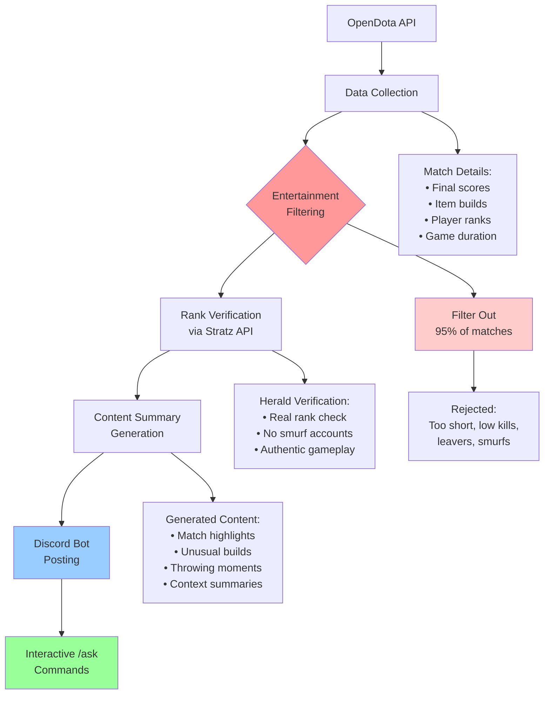

## Finding Entertainment in the Chaos

The project started with a straightforward problem: Jenkins, a Dota 2 caster known for Herald-tier match commentary, needed a steady supply of entertaining games. Herald matches (the lowest skill bracket) can be pure comedy—players making bizarre item choices, forgetting basic mechanics, or throwing massive leads in spectacular fashion. The challenge was finding these gems among thousands of daily matches.

My initial approach was simple SQL queries against OpenDota's API:
```sql
SELECT match_id, duration, kills 
FROM public_matches 
WHERE avg_rank_tier <= 15 
  AND duration > 4500
```

I'd run these queries, manually filter for the most entertaining matches, then send them to Jenkins during his streams. It worked well but was completely manual—taking hours to find a handful of good matches.

## Automating the Hunt

The manual process couldn't scale. What started as occasional help became a time-consuming routine of running queries, reviewing replays, and timing deliveries for live streams. The solution was obvious: automate everything.

The bot evolved through several iterations:

1. **Telegram notifications**: Simple automated queries with basic filtering
2. **Discord integration**: Better community features and interaction
3. **Smart filtering**: Kill density calculations, duration thresholds, rank verification
4. **Content generation**: Automated match summaries and highlights

## How the Pipeline Works

The current system processes thousands of matches daily to find the most entertaining ones. It's a six-stage pipeline that narrows down matches from the full pool to the ~5% worth watching:



**Data Collection**: The bot pulls recent Herald matches and enriches them with detailed game statistics—final scores, item builds, skill builds, and verified player ranks.

**Entertainment Filtering**: This is where interesting matches get identified. The system looks for:
- Long games (75-120 minutes) where neither team can close
- High kill counts (1+ per minute) from constant fighting 
- Complete matches with no leavers

**Rank Verification**: Using Stratz API, the bot confirms players are actually Herald rank (not smurfs), ensuring authentic low-skill gameplay.

**Content Summary**: The system generates brief match highlights, noting unusual item choices, long game duration, and standout moments—providing a quick overview without needing to watch the full replay.

## What Makes These Matches Entertaining

Herald games have a specific appeal—they're relatable disasters. Everyone who's played Dota has forgotten to buy boots, made questionable late-game calls, or thrown away a winning position. Herald matches just turn these universal experiences up to 11.

The entertainment isn't about mocking bad players; it's about recognizing ourselves in these chaotic moments. A 75-minute game where both teams refuse to push high ground, or a carry who builds three of the same item—these are memorable because they're amplified versions of mistakes we've all made.

## Interactive Match Exploration

Beyond just posting matches, the bot includes an `/ask` command that lets users dive deeper into specific games. You can ask about weird item builds, throwing moments, or why a match lasted so long. Instead of just seeing "Crystal Maiden bought 3 Dagons," you can ask why and get context about the player's decision-making throughout the game.

This turns static match posts into interactive discussions where the community can explore the most entertaining moments together.

## The Technical Evolution

The progression from manual SQL queries to automated content discovery followed a typical software evolution:

**Manual queries** → **Basic automation** → **Smart filtering** → **Content generation**

Each step solved specific bottlenecks:
- Manual work was too time-consuming
- Basic automation lacked quality filtering
- Smart filtering still required human review
- Content generation finally scaled the entire process

## Building Community Through Automation

What makes this project interesting isn't just the technical automation—it's how it creates community interaction. The `/ask` command turns each match into a discussion starter. Instead of passive content consumption, users actively explore matches together, sharing their own similar experiences and laughing at familiar mistakes.

The bot essentially automated the talent scouting process while maintaining the community aspect that makes Herald content engaging. It finds the matches, provides context, and facilitates conversation—but the entertainment comes from shared recognition of universal gaming struggles.

## Lessons in Scalable Content Curation

This project demonstrates a few key principles about automating content discovery:

1. **Start simple**: Basic SQL queries worked fine for manual processes
2. **Automate incrementally**: Each automation step solved a specific bottleneck  
3. **Preserve the human element**: Automation should enhance community interaction, not replace it
4. **Quality over quantity**: Better to find 5% of truly entertaining matches than flood channels with mediocre content

The Herald Scraper Bot proves that effective automation isn't about replacing human judgment—it's about scaling human insight to handle larger datasets while preserving what makes content engaging in the first place.